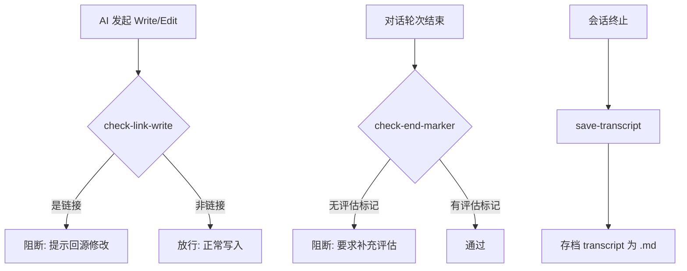

# Harness — AI 协作工程规范分发中心

> 通过**软链接**为多个业务工程提供共享的 AI 工作规范（`CLAUDE.md`）、通用技能（Skills）、Hook 脚本和 IDE 引导规则。遵循"一处修改、全局生效"的设计理念，本仓库本身不直接产生业务价值。

---

## 设计理念

所有业务工程通过软链接指向本仓库的规范文件，实现**集中维护、按需分发**：

- **CLAUDE.md / Skills / Hooks** → 软链接分发，源仓库修改后所有下游工程自动同步
- **`.cursorrules`** → 物理文件分发，允许下游工程按需本地化覆盖
- **Hook 保护** → `check-link-write.py` 阻止 AI 对链接文件直接写入，强制回源修改

---

## 前置条件

| 平台 | 要求 |
|------|------|
| **Windows** | 开启[开发者模式](https://learn.microsoft.com/windows/apps/get-started/enable-your-device-for-development) 或 **以管理员身份运行**终端（创建软链接需要 `SeCreateSymbolicLinkPrivilege`） |
| **Linux** | `ln` 命令开箱即用 |
| **macOS** | `ln` 命令开箱即用 |

---

## 目录结构

```
harness/
├── CLAUDE.md                      # AI 协作规范（REAP 流程、行为红线、协作约定）
├── README.md                      # 本文件
├── init-ai-skills.sh              # Linux/macOS 初始化脚本
├── init-ai-skills.ps1             # Windows 初始化脚本
├── .cursorrules                   # IDE 引导规则（含每轮知识沉淀评估要求）
├── .gitignore
└── .claude/
    ├── settings.json              # Hook 配置（PreToolUse / Stop / SessionEnd）
    ├── settings.local.json        # 本地权限覆盖（不参与分发）
    ├── hooks/
    │   ├── check-link-write.py    # 阻止对软/硬链接文件的直接写入
    │   ├── check-end-marker.py    # 强制每轮对话结束进行知识沉淀评估
    │   └── save-transcript.py     # 会话结束时将 transcript 存档为 Markdown
    └── skills/
        ├── git-commit/       # 自动 Git 提交与推送
        ├── context-guard/         # 对话上下文价值评估与沉淀
        ├── golang-patterns/       # Go 代码模式、审查与重构
        ├── key-points-mem/        # 通用知识库（REAP 流程 R 阶段默认调用）
        ├── python-expert/         # Python 编码、类型提示、调试
        └── skill-creator/         # 创建/注册新技能
```

---

## 快速接入

```bash
# Linux / macOS
cd /path/to/harness
./init-ai-skills.sh /path/to/target-project

# Windows（需开发者模式或管理员权限）
cd \path\to\harness
.\init-ai-skills.ps1 \path\to\target-project
```

脚本在目标工程中创建以下内容：

| 目标 | 类型 | 说明 |
|------|------|------|
| `CLAUDE.md` | 软链接 | AI 协作规范（REAP 流程、行为红线） |
| `.claude/skills/*/` | 软链接 | 各通用技能目录 |
| `.claude/settings.json` | 软链接 | Hook 触发配置 |
| `.claude/hooks/*.py` | 软链接 | Python Hook 脚本 |
| `.cursorrules` | 物理文件 | IDE 引导规则（支持本地化修改） |
| `.gitignore`（更新） | 物理文件 | 追加链接文件忽略规则 |

---

## Hook 体系

Hook 由 `.claude/settings.json` 驱动，分发到目标工程后由 Claude Code CLI 自动加载：

| 事件 | 脚本 | 触发时机 | 行为 |
|------|------|----------|------|
| `PreToolUse` | `check-link-write.py` | 每次 Write / Edit 操作前 | 检测目标文件是否为软/硬链接，是则**阻断**并提示回源仓库修改 |
| `Stop` | `check-end-marker.py` | 每轮对话结束时 | 检测最终回复是否包含 `已评估知识沉淀价值`，缺失则**阻断**并要求补充评估 |
| `SessionEnd` | `save-transcript.py` | 会话终止时 | 将全量 JSONL transcript 解析为结构化 Markdown，存档到 `.context-guard/transcripts/` |

### Hook 执行流程



---

## 知识沉淀体系

两层沉淀架构，按复用范围分流：

| 层级 | 位置 | 内容 | 触发方式 |
|------|------|------|----------|
| **工程级** | `<业务工程>/.context-guard/` | 对话上下文、决策过程、踩坑记录 | Stop Hook 强制 + AI 自主评估 |
| **通用级** | `.claude/skills/key-points-mem/references/` | 跨工程可复用的设计模式、避坑指南 | 用户主动授权后 AI 提炼写入 |

### 评估标准

每轮对话结束时，AI 需逐项检查本轮是否涉及以下**六大信号**：

1. **架构决策** — 涉及系统分层、模块边界、技术选型
2. **根因分析** — 定位问题根因而非表面症状
3. **规范确立** — 制定或修改编码规范、命名约定
4. **知识盲区** — 暴露出团队或 AI 的知识空白
5. **方案对比** — 存在 A/B 方案对比与取舍讨论
6. **踩坑记录** — 遇到并解决了非显而易见的坑

**命中任一信号** → 将结论写入 `.context-guard/`，回复「已记录」或「等待确认」。

**全部未命中** → 回复「已评估知识沉淀价值（跳过：原因）」。

---

## 技能清单

每个技能通过 `SKILL.md` 定义触发规则和使用说明，AI 自动按需加载：

| 技能 | 触发场景 |
|------|----------|
| **git-commit** | "帮我提交"、"commit"、"push" |
| **context-guard** | 对话上下文价值评估与自动沉淀 |
| **golang-patterns** | Go 代码编写、审查、重构 |
| **key-points-mem** | REAP 的 R 阶段默认调用，通用知识检索 |
| **python-expert** | Python 编码、类型提示、调试 |
| **skill-creator** | "创建新技能"、"注册 skill" |

---

## 故障排查

| 症状 | 原因 | 解决 |
|------|------|------|
| `ln: 无法创建符号链接` / `New-Item : 拒绝访问` | 缺少创建软链接的权限 | Windows：开启开发者模式或以管理员运行终端 |
| 下游工程未同步最新规范 | 软链接指向的源仓库已更新但未 re-init | 重新运行 `init-ai-skills` 脚本 |
| `check-link-write.py` 误阻断 | 目标文件为 `key-points-mem/references/` 下的物理文件 | 该路径为白名单，检查文件路径是否正确 |
| `hook timeout` | Python 未安装或路径错误 | 确保 `python` 可在 PATH 中找到 |

---

## 扩展技能

如需添加新技能，使用内置的 `skill-creator` 技能（触发词："创建新技能"），或手动执行：

```bash
# 在 harness 仓库中
mkdir -p .claude/skills/<new-skill>
cp .claude/skills/skill-creator/template/SKILL.md .claude/skills/<new-skill>/SKILL.md
# 编辑 SKILL.md 定义触发规则和内容
# 重新 init 到目标工程即可生效
```
